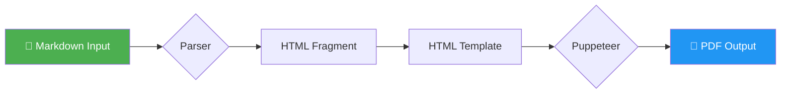
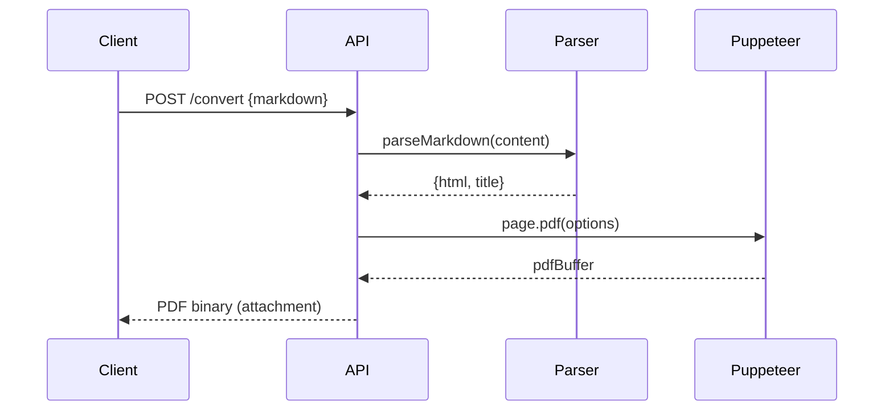
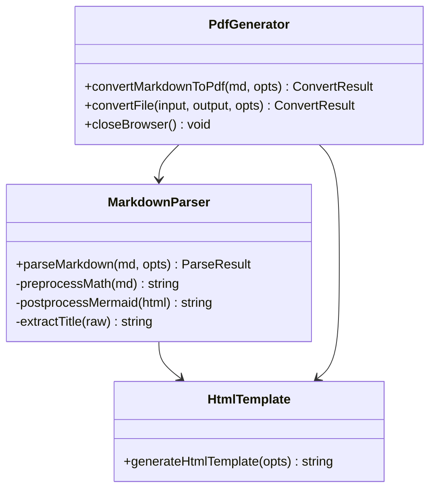

# md2pdf Sample Document

[[toc]]

---

# Welcome to md2pdf-lab 🚀

This is a **sample Markdown document** demonstrating all supported features.

> "Any sufficiently advanced technology is indistinguishable from magic."  
> — Arthur C. Clarke

---

## 1. Text Formatting

Paragraphs are separated by blank lines. You can use **bold**, *italic*, ~~strikethrough~~, and `inline code`.

Here's a [hyperlink to the repository](https://github.com/your-org/md2pdf-lab) and an auto-linked URL: https://example.com.

---

## 2. Headings

# Heading 1
## Heading 2
### Heading 3
#### Heading 4
##### Heading 5
###### Heading 6

---

## 3. Lists

### Unordered List
- Node.js 20+
- TypeScript 5+
- Puppeteer
- Highlight.js
  - Languages: JS, Python, Rust, Go…
  - Themes: GitHub, atom-one-dark…

### Ordered List
1. Install dependencies: `npm install`
2. Build the project: `npm run build`
3. Run the CLI: `md2pdf convert readme.md`
4. Open the generated PDF

### Task List
- [x] Set up project structure
- [x] Implement Markdown parser
- [x] Integrate Puppeteer
- [ ] Add more PDF themes
- [ ] Publish to npm

---

## 4. Tables

| Feature        | Status  | Notes                    |
|----------------|---------|--------------------------|
| Markdown → PDF | ✅ Done  | Puppeteer + markdown-it  |
| Themes         | ✅ Done  | Light, Dark, GitHub      |
| Table of Contents | ✅ Done | Auto-generated          |
| Math (MathJax) | ✅ Done  | Display + inline         |
| Mermaid Diagrams | ✅ Done | Auto-detected            |
| CLI Tool       | ✅ Done  | Commander.js             |
| REST API       | ✅ Done  | Express + Zod            |
| Terminal Game  | ✅ Done  | Markdown Dungeon         |
| Docker         | ✅ Done  | Multi-stage Alpine       |
| CI/CD          | ✅ Done  | GitHub Actions + GCP     |

---

## 5. Code Blocks

### JavaScript
```javascript
// Async function with error handling
async function convertMarkdown(inputPath) {
  try {
    const content = await fs.readFile(inputPath, 'utf-8');
    const { pdfBuffer } = await convertMarkdownToPdf(content, {
      theme: 'dark',
      pageSize: 'A4',
    });
    await fs.writeFile('output.pdf', pdfBuffer);
    console.log('✅ PDF generated!');
  } catch (error) {
    console.error('❌ Conversion failed:', error.message);
  }
}
```

### TypeScript
```typescript
interface ConvertOptions {
  theme: 'light' | 'dark' | 'github';
  pageSize: 'A4' | 'Letter' | 'Legal';
  margin?: number;
  toc?: boolean;
}

const options: ConvertOptions = {
  theme: 'dark',
  pageSize: 'A4',
  margin: 15,
  toc: true,
};
```

### Python
```python
import requests
import json

def convert_to_pdf(markdown_text: str, output_path: str) -> None:
    """Send markdown to the md2pdf REST API and save PDF."""
    response = requests.post(
        "http://localhost:8080/convert",
        json={"markdown": markdown_text, "theme": "github"},
        stream=True,
    )
    response.raise_for_status()
    with open(output_path, "wb") as f:
        f.write(response.content)
    print(f"PDF saved to {output_path}")
```

### Bash
```bash
# Convert with custom options
md2pdf convert README.md output.pdf \
  --theme dark \
  --page-size A4 \
  --margin 20 \
  --header-footer

# Watch mode
md2pdf watch notes.md --theme github

# Start API server
md2pdf serve --port 3000
```

### Rust
```rust
fn fibonacci(n: u64) -> u64 {
    match n {
        0 => 0,
        1 => 1,
        _ => fibonacci(n - 1) + fibonacci(n - 2),
    }
}

fn main() {
    for i in 0..10 {
        println!("fib({}) = {}", i, fibonacci(i));
    }
}
```

---

## 6. Blockquotes

> **Note**: This document was rendered using **md2pdf-lab**.
>
> Blockquotes can span multiple paragraphs.
> They're great for callouts, quotes, and tips.

> **Tip** 💡  
> Use `--theme dark` for a sleek dark mode PDF.

---

## 7. Math (MathJax)

### Inline Math

Einstein's famous equation: $E = mc^2$, where $c \approx 3 \times 10^8\,\text{m/s}$.

The quadratic formula is $x = \frac{-b \pm \sqrt{b^2 - 4ac}}{2a}$.

### Display Math

$$
\int_{-\infty}^{\infty} e^{-x^2} \, dx = \sqrt{\pi}
$$

$$
\nabla \times \mathbf{B} = \mu_0 \left( \mathbf{J} + \epsilon_0 \frac{\partial \mathbf{E}}{\partial t} \right)
$$

---

## 8. Mermaid Diagrams

### Flowchart



### Sequence Diagram



### Class Diagram



---

## 9. Images


*Example: Architecture diagram (replace with real diagram)*

---

## 10. Horizontal Rules and Typography

The em-dash — a versatile punctuation mark. Ellipsis… Auto-linked: https://npmjs.com.

---

*Generated with **md2pdf-lab** · © 2026 · MIT License*
